# uart_rmtx

ESPHome UART component for the Waveshare ESP32-S3-Relay-6CH RS485 port. It receives on the hardware UART and transmits via the RMT peripheral using a sub-bit line code. The line code keeps the board's auto-direction transceiver enabled during long constant-level runs that the stock UART driver cannot sustain.

The component subclasses `uart::IDFUARTComponent` and inherits receive (`read_array`, `peek_byte`, `available`) unchanged. It overrides only `write_array` and `flush` to drive an RMT TX channel on a separate GPIO. Any ESPHome consumer that takes a `uart_id` works against it.

## The problem it solves

The 6CH RS485 stage uses an SP485EEN transceiver whose DE/RE pins are driven by a discrete RC one-shot, not a GPIO. TXD charges a 1 nF cap through a 56 k resistor (τ = 56 µs). DE drops when the cap crosses the 74HC04 Schmitt low threshold, around 64 µs after the last transition.

At 38400 baud a bit time is 26 µs, so the one-shot times out roughly 2.5 bits into a constant-level run. The worst case is `0xFF`: start + 8 ones + stop is 9 bits (~234 µs) of continuous high. DE drops mid-byte and corrupts the frame. The 153-byte SAM device-info reply routinely hit this and piled up CRC failures.

```mermaid
gantt
    title 0xFF at 38400 baud - RC one-shot (τ ≈ 56µs, DE drops ~64µs after last edge)
    dateFormat X
    axisFormat %sµs

    section Plain NRZ (0xFF = start+8 ones+stop)
    start (0)          :active, 0, 26
    one (1)            :active, 26, 52
    one (2)            :active, 52, 78
    one (3)            :active, 78, 104
    one (4)            :crit, 104, 130
    one (5)            :crit, 130, 156
    one (6)            :crit, 156, 182
    one (7)            :crit, 182, 208
    stop (1)           :active, 208, 234

    section N=3 line code (110 per 1-bit)
    110 (start=0)      :done, 0, 26
    110 (1)            :done, 26, 52
    110 (2)            :done, 52, 78
    110 (3)            :done, 78, 104
    110 (4)            :done, 104, 130
    110 (5)            :done, 130, 156
    110 (6)            :done, 156, 182
    110 (7)            :done, 182, 208
    110 (stop=1)       :done, 208, 234
```



The red bits on the NRZ row are where the cap has decayed past the Schmitt threshold and DE has dropped. The line-code row has no such window: every bit has a transition at 2/3.

The line code breaks the long run. Each logical bit becomes N sub-bits with one transition late in the bit. A standard UART receiver samples near the bit center and reads the correct level, because the transition lands past the sample window. The one-shot sees an edge well before its 64 µs timeout.

```
N=3 (default), transition at 2/3 of the bit:

  logical 1: 1 1 0   (two high, one low)
  logical 0: 0 0 1   (two low, one high)
```

<table>
  <tr>
    <th>plain 38400</th>
    <td colspan="3" align="center">0</td>
    <td colspan="3" align="center">1</td>
    <td colspan="3" align="center">1</td>
    <td colspan="3" align="center">1</td>
  </tr>
  <tr>
    <th>line code 115200</th>
    <td align="center">0</td><td align="center">0</td><td align="center">1</td>
    <td align="center">1</td><td align="center">1</td><td align="center">0</td>
    <td align="center">1</td><td align="center">1</td><td align="center">0</td>
    <td align="center">1</td><td align="center">1</td><td align="center">0</td>
  </tr>
</table>

Each logical bit spans the same wall-clock time. In the plain row, the three `1` bits form an unbroken high plateau and the cap discharges past the Schmitt threshold. In the line-code row, the trailing `0` of each `110` group creates an edge every sub-bit, so the cap refreshes before it crosses the threshold. `0xFF` is eight consecutive `1`s plus a stop bit.

The longest gap between edges is one logical bit time (26 µs at 38400), regardless of N. The one-shot sees edges 2.4× faster than its dropout.

## Configuration

```yaml
uart_rmtx:
  - id: bus_uart
    tx_pin: GPIO17      # RMT TX GPIO. NOT forwarded to the hardware UART.
    rx_pin: GPIO18      # hardware UART RX
    baud_rate: 38400
    data_bits: 8
    parity: NONE
    stop_bits: 1
    rx_buffer_size: 4096
    sub_bits: 3         # line code: 110/001, transition at 2/3
    rmt_mem_symbols: 64
```

The component supports multiple instances with standard ESPHome list syntax (`-` prefix, unique `id`s).

### Options

| Option | Default | Notes |
|---|---|---|
| `baud_rate` | (required) | |
| `tx_pin` | (required) | RMT TX GPIO. The hardware UART never claims this pin. |
| `rx_pin` | (required) | Hardware UART RX. Receive uses the IDF UART driver with 16× oversampling. |
| `rx_buffer_size` | 4096 | Hardware UART RX ring buffer, bytes. |
| `stop_bits` | 1 | 1 or 2. |
| `data_bits` | 8 | 5 to 8. |
| `parity` | NONE | NONE, EVEN, ODD. |
| `rx_full_threshold` | computed | Bytes per ~10 ms, clamped to 1-120 (37 at 38400 8N1). Matches the stock `uart` component. |
| `rx_timeout` | 2 | Hardware UART RX timeout, symbol times. |
| `flush_timeout` | (none) | Milliseconds to wait for TX to drain. Default waits indefinitely. |
| `sub_bits` | 3 | Sub-bits per logical bit (N). See the table below. |
| `rmt_mem_symbols` | 64 | RMT channel RAM size, symbols. The IDF driver ping-pongs within this; larger buys refill margin. |

### `sub_bits` (N)

N sets the RMT clock to N × baud and the per-bit pattern. The transition lands at (N-1)/N of the bit, past the last 3× oversample point (62.5%) so a standard UART receiver reads clean.

| N | RMT clock | 1-code | 0-code | transition at | receiver clean window |
|---|-----------|--------|--------|---------------|-----------------------|
| 1 | 38400 | 1 | 0 | (no transition) | plain NRZ (diagnostic) |
| 3 | 115200 | 110 | 001 | 2/3 | 67% |
| 4 | 153600 | 1110 | 0001 | 3/4 | 75% |
| 6 | 230400 | 111110 | 000001 | 5/6 | 83% |

N=2 is unsafe (the transition lands on the 50% sample point). There is no useful value between 2 and 3.

N=3 is the production default. It clears the oversample floor at the lowest RMT clock and produces the fewest symbols per frame. N=4 and N=6 trade a faster RMT clock for a wider receiver window. Use them if a target device samples early.

## How it works

### Architecture

`RmtTxUARTComponent : public uart::IDFUARTComponent`. Single inheritance from the concrete hardware-UART component. Receive methods are inherited literally. Only `write_array` and `flush` are overridden.

The TX pin conflict resolves without any GPIO hacking. Codegen passes `rx_pin` to the base UART but never calls `set_tx_pin`, so `IDFUARTComponent::load_settings()` opens the hardware UART with `tx = UART_PIN_NO_CHANGE` (RX only). The RMT channel then owns the TX GPIO. No `uart_set_pin` or `gpio_reset_pin` is needed.

The line-code encoder is header-only (`line_code_encoder.h`) and host-testable without ESPHome.

### TX path

`write_array` encodes the frame into a contiguous RMT symbol buffer on the main loop, then hands it to the IDF v5 RMT driver with `rmt_new_copy_encoder`. The driver's threshold ISR refills the 48-word/channel RAM by `memcpy` of pre-encoded symbols. The encoder does the heavy work (bit walk, run coalescing, Bresenham tick distribution) once per frame on the main loop. The ISR stays cheap.

DMA is off (`with_dma = 0`). Non-DMA ping-pong streams frames of any length through the per-channel RAM. At 38400 baud one 48-word block gives a 24-word ping-pong half that drains in roughly 625 µs. The refill ISR runs in single-digit microseconds on a 240 MHz core, so it has 60-100× margin per refill. A 266-byte frame (the worst-case ABCD frame) drains in 70 ms, the physical minimum for that length at that baud, repeatable with no stalls.

### The line code and the auto-direction one-shot

The `0xFF` worst case cannot exist in the line-coded waveform. Each bit has a 1-to-0 transition at 2/3 (N=3), so a run of 1-bits has an edge every sub-bit. The one-shot retriggers continuously and never times out.

The bus turnaround is built in. After the last TX bit the line goes idle (high) and stops transitioning. The cap discharges across the Schmitt threshold at ~64 µs and DE releases on its own. No explicit pin toggle is required.

## Validation

Bench-tested against a physical SAM (SYSTXCCSAM01 at 0x92) over a direct RS485 link, via the `sam_bridge` TCP path (samnet port 6969). The probe sends an `0104` READ frame and counts CRC-valid replies.

| TX config | reply rate | CRC errors |
|---|---|---|
| stock IDF UART (baseline) | 81% (65/80) | 0 |
| N=3 line code | 100% (160/160) | 0 |
| N=4 line code | 93% (149/160) | 0 |

The baseline is below 100% because the SAM's responsiveness varies with its sync-loop phase. N=3 cleared the baseline. The most thorough run was a register scan of 3557 queries over 15 minutes with zero terminal timeouts and zero CRC errors.

A third-party observer on the RS485 segment was not available, so the long-frame TX path (the historical corruption case) is validated on the structural argument: every bit has a transition, so a long frame is just more bits to the one-shot. The RMT engine can sustain long frames (266-byte frames at 70 ms wire time, repeatable). End-to-end CRC of a long frame over the wire is the remaining untested step.

## Platform requirements

- ESP32 (tested on ESP32-S3). The component uses the IDF v5 RMT driver and subclasses `IDFUARTComponent`, so it requires the esp-idf framework. Not compatible with Arduino or ESP8266.
- One RMT TX channel per instance. The RGB LED channel on the 6CH (`esp32_rmt_led_strip` on GPIO38) coexists without conflict on a separate channel.

## Files

- `uart_rmtx.h` / `uart_rmtx.cpp` - the component
- `line_code_encoder.h` - the encoder, header-only and host-testable
- `__init__.py` - config schema and codegen

The line code and its design rationale are documented in `private/hardware-research/rs485-rmt-linecode-hack.md` (repository-private).
